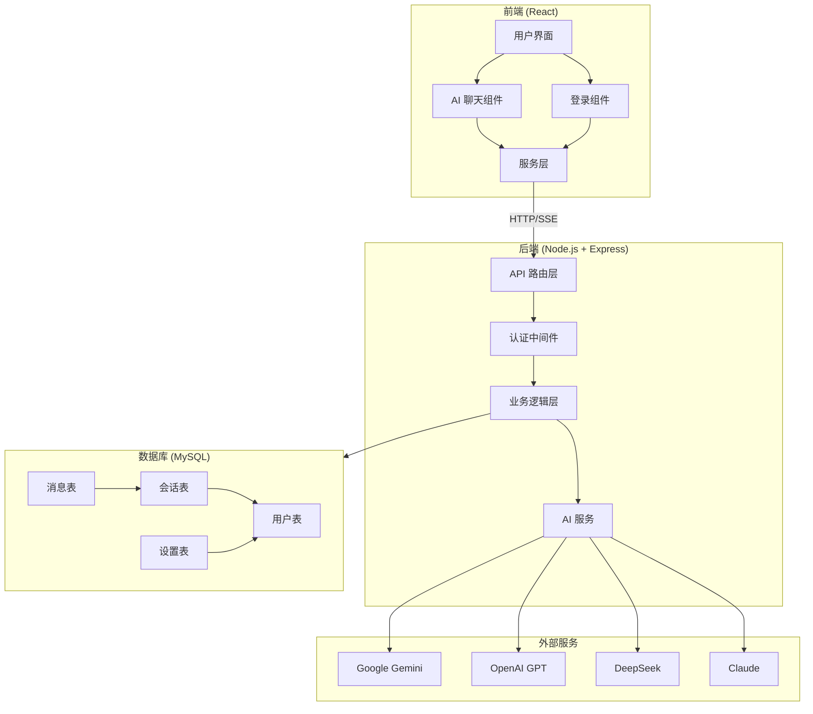
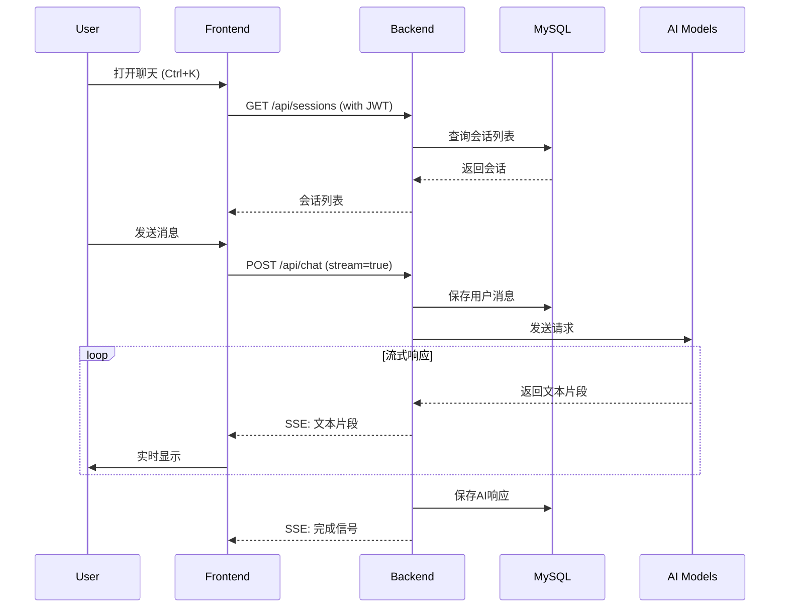
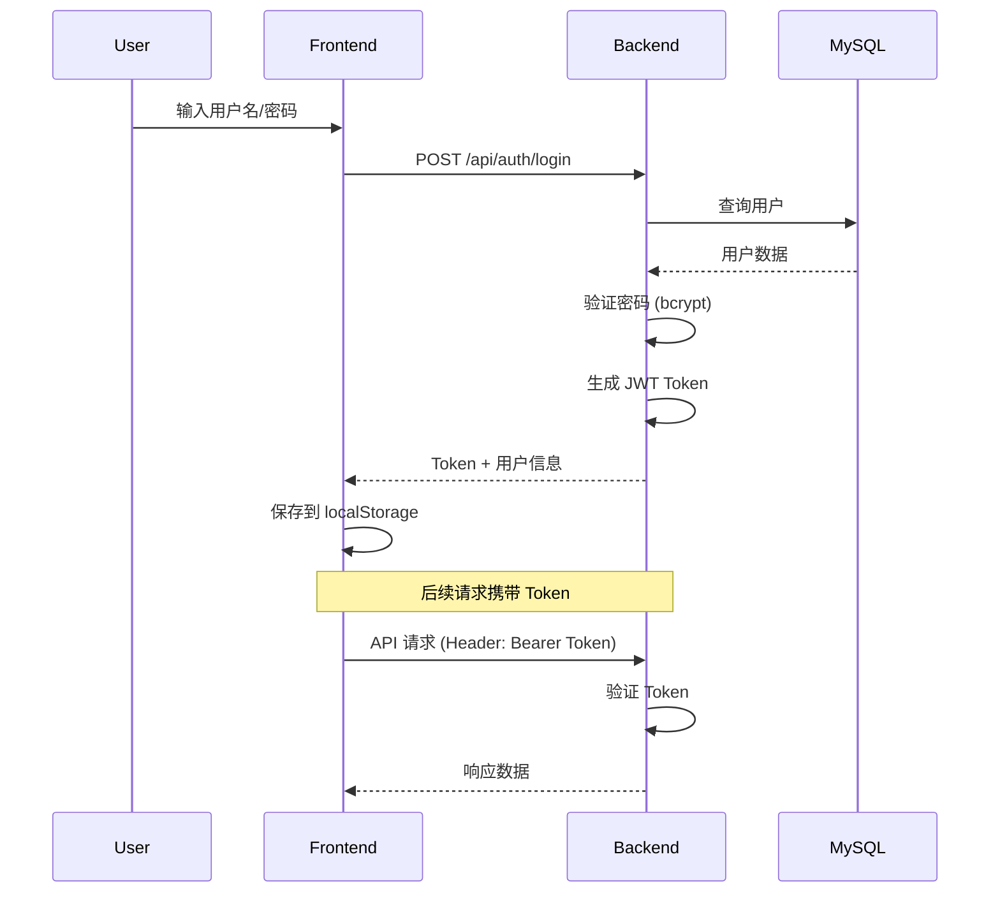
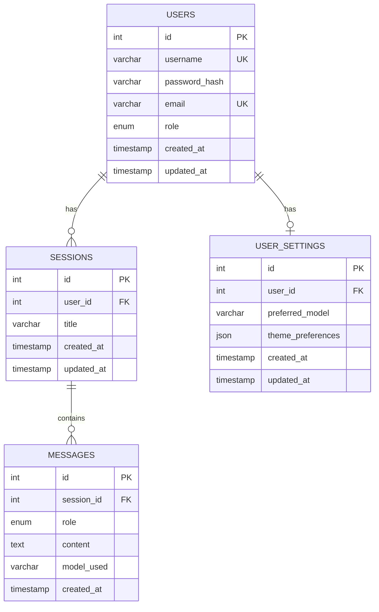

# Forsion Desktop 系统架构

## 系统架构图



## 数据流图



## 认证流程



## 目录结构详解

```
Forsion-Desktop/
│
├── Frontend (前端)
│   ├── components/              # React 组件
│   │   ├── AIChat.tsx          # AI 聊天主组件
│   │   ├── LoginModal.tsx      # 登录/注册模态框
│   │   ├── Dock.tsx            # 底部 Dock
│   │   ├── TopBar.tsx          # 顶部栏
│   │   ├── WindowManager.tsx   # 窗口管理器
│   │   └── WidgetBoard.tsx     # 小部件面板
│   │
│   ├── services/               # 前端服务层
│   │   ├── apiService.ts       # API 基础封装
│   │   ├── authService.ts      # 认证服务
│   │   ├── chatService.ts      # 聊天服务
│   │   ├── modelService.ts     # 模型服务
│   │   └── geminiService.ts    # Gemini 直接调用
│   │
│   ├── App.tsx                 # 主应用组件
│   ├── types.ts                # TypeScript 类型定义
│   ├── constants.tsx           # 常量配置
│   └── vite.config.ts          # Vite 配置
│
├── Backend (后端)
│   └── server/
│       ├── src/
│       │   ├── index.ts        # 服务器入口
│       │   │
│       │   ├── routes/         # API 路由层
│       │   │   ├── auth.ts     # 认证路由
│       │   │   ├── chat.ts     # 聊天路由
│       │   │   ├── sessions.ts # 会话路由
│       │   │   ├── messages.ts # 消息路由
│       │   │   └── settings.ts # 设置路由
│       │   │
│       │   ├── services/       # 业务逻辑层
│       │   │   ├── authService.ts     # 认证逻辑
│       │   │   ├── aiService.ts       # AI 调用逻辑
│       │   │   ├── sessionService.ts  # 会话管理
│       │   │   ├── messageService.ts  # 消息管理
│       │   │   ├── modelService.ts    # 模型管理
│       │   │   └── settingsService.ts # 设置管理
│       │   │
│       │   ├── middleware/     # 中间件
│       │   │   └── auth.ts     # JWT 认证中间件
│       │   │
│       │   ├── db/             # 数据库层
│       │   │   ├── connection.ts  # 连接池配置
│       │   │   ├── schema.sql     # 表结构定义
│       │   │   └── seed.ts        # 数据初始化
│       │   │
│       │   └── types/          # 类型定义
│       │       └── index.ts    # 共享类型
│       │
│       ├── package.json
│       └── tsconfig.json
│
├── Documentation (文档)
│   ├── README.md                    # 项目说明
│   ├── QUICKSTART.md               # 快速开始
│   ├── IMPLEMENTATION.md           # 实施文档
│   ├── COMPLETION_SUMMARY.md       # 完成总结
│   ├── DEPLOYMENT_CHECKLIST.md     # 部署检查清单
│   └── ARCHITECTURE.md             # 本文件
│
└── Scripts (脚本)
    ├── start-dev.sh                # Linux/Mac 启动脚本
    └── start-dev.ps1               # Windows 启动脚本
```

## 技术栈详解

### 前端技术栈

| 技术 | 版本 | 用途 |
|------|------|------|
| React | 19.2.3 | UI 框架 |
| TypeScript | 5.8.2 | 类型安全 |
| Vite | 6.2.0 | 构建工具 |
| Framer Motion | 12.23.26 | 动画库 |
| Lucide React | 0.562.0 | 图标库 |
| @google/genai | 1.34.0 | Gemini SDK |

### 后端技术栈

| 技术 | 版本 | 用途 |
|------|------|------|
| Node.js | 18+ | 运行时 |
| Express | 4.21.2 | Web 框架 |
| TypeScript | 5.8.2 | 类型安全 |
| MySQL | 8.0+ | 数据库 |
| mysql2 | 3.11.5 | MySQL 驱动 |
| jsonwebtoken | 9.0.2 | JWT 认证 |
| bcrypt | 5.1.1 | 密码加密 |
| cors | 2.8.5 | CORS 支持 |
| dotenv | 16.4.5 | 环境变量 |

### AI 模型集成

| 模型 | SDK | 状态 |
|------|-----|------|
| Google Gemini | @google/generative-ai | ✅ 已集成 |
| OpenAI GPT | openai | ✅ 已集成 |
| DeepSeek | openai (兼容) | ✅ 已集成 |
| Anthropic Claude | openai (兼容) | ✅ 已集成 |

## 数据库设计

### ER 图



## API 端点总览

### 认证 API

| 方法 | 端点 | 认证 | 说明 |
|------|------|------|------|
| POST | /api/auth/register | ❌ | 用户注册 |
| POST | /api/auth/login | ❌ | 用户登录 |
| GET | /api/auth/me | ✅ | 获取当前用户 |
| POST | /api/auth/logout | ✅ | 登出 |

### 会话 API

| 方法 | 端点 | 认证 | 说明 |
|------|------|------|------|
| GET | /api/sessions | ✅ | 获取所有会话 |
| POST | /api/sessions | ✅ | 创建新会话 |
| GET | /api/sessions/:id | ✅ | 获取会话详情 |
| PUT | /api/sessions/:id | ✅ | 更新会话 |
| DELETE | /api/sessions/:id | ✅ | 删除会话 |

### 消息 API

| 方法 | 端点 | 认证 | 说明 |
|------|------|------|------|
| GET | /api/sessions/:id/messages | ✅ | 获取会话消息 |
| POST | /api/sessions/:id/messages | ✅ | 保存消息 |
| DELETE | /api/messages/:id | ✅ | 删除消息 |

### 聊天 API

| 方法 | 端点 | 认证 | 说明 |
|------|------|------|------|
| POST | /api/chat | ✅ | 发送消息（支持SSE） |
| GET | /api/chat/models | ✅ | 获取模型列表 |

### 设置 API

| 方法 | 端点 | 认证 | 说明 |
|------|------|------|------|
| GET | /api/settings | ✅ | 获取用户设置 |
| PUT | /api/settings | ✅ | 更新用户设置 |

## 安全架构

### 认证流程

1. **密码存储**：使用 bcrypt (10 rounds) 加密
2. **Token 生成**：JWT with HS256 算法
3. **Token 存储**：前端 localStorage
4. **Token 验证**：中间件自动验证

### 数据保护

- SQL 注入防护：参数化查询
- XSS 防护：React 自动转义
- CORS 配置：限制跨域访问
- API Key 保护：环境变量管理

## 性能优化

### 数据库优化

- 连接池：最大 10 个连接
- 索引：用户名、邮箱、会话 ID
- 外键约束：自动级联删除

### 前端优化

- 代码分割：Vite 自动处理
- 懒加载：组件按需加载
- 缓存：模型列表缓存

### 后端优化

- 流式响应：减少首字节时间
- 连接复用：HTTP Keep-Alive
- 错误处理：统一中间件

## 扩展性

### 水平扩展

- 无状态 API：JWT 认证
- 数据库读写分离：主从复制
- 负载均衡：Nginx

### 功能扩展

- 插件系统：模块化设计
- 自定义模型：配置化
- 多语言支持：i18n ready

## 部署架构

### 开发环境

```
Frontend (Vite Dev Server)  →  Backend (tsx watch)  →  MySQL (Local)
    :3000                           :3001                  :3306
```

### 生产环境

```
Nginx (Reverse Proxy)  →  Frontend (Static)
                      →  Backend (PM2)  →  MySQL (Production)
```

## 监控和日志

### 日志记录

- 请求日志：timestamp + method + path
- 错误日志：console.error
- 数据库日志：MySQL slow query log

### 性能监控

- API 响应时间
- 数据库查询时间
- 内存使用情况
- CPU 使用率

---

更多详细信息请参考：
- [实施文档](./IMPLEMENTATION.md)
- [API 文档](./API_DOCUMENTATION.md)
- [部署指南](./DEPLOYMENT_CHECKLIST.md)


